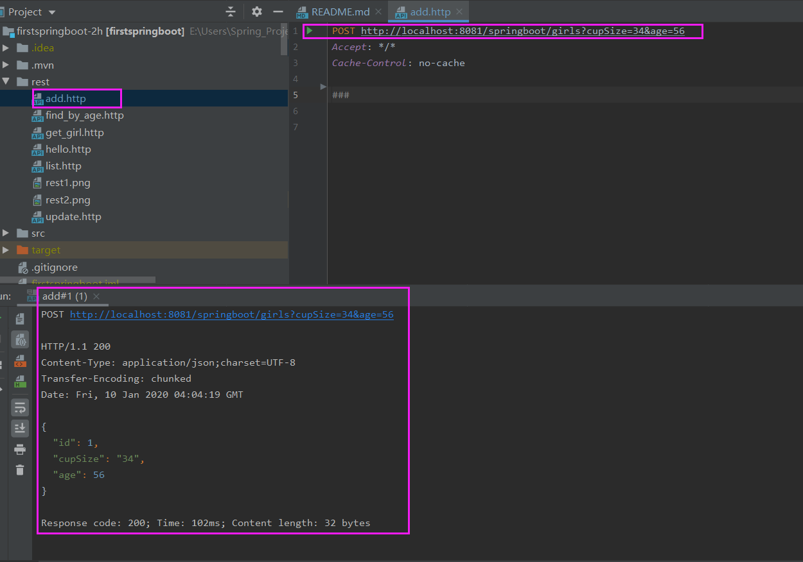

# 搭建第一个sping boot 程序

参考：
https://blog.csdn.net/forezp/article/details/61472783

本文出自方志朋的博客

## 学习记录：

项目介绍：
---

一、application.yml文件内容介绍：
---
主要配置内容如下：
```
spring:
  profiles:
    active: prod
  datasource:
  jpa:
server:
  port: 8081
  context-path: /springboot
>>>
cupSize: B
age: 18
content: content:${cupSize},age:${age}
girl:
  cupSize: F
  age: 18
  content: content:${cupSize},age:${age}
```
#### application.yml文件解析
* 应用的端口为8081,应用的context-path为:[/springboot]：
```server.context-path= # Context path of the application. 应用的上下文路径，也可以称为项目路径，是构成url地址的一部分。```
* profiles:active:指定不同环境的配置
* datasource和jpa分别关联数据库配置及数据表的创建配置
* application.yml里面定义的属性
    * 在application.yml里面可以使用${xxx}获取到
    * 在程序代码中可以通过给属性加注解@Value("${name}")获取到
* application.yml里面定义的对象如：girl
    * 在代码中使用时，需要使用创建GirlProperties类...具体在下面介绍
    
二、Controller介绍
---

```
@RestController     //等同于同时加上了@Controller和@ResponseBody
public class HelloController {
   
    //访问/hello或者/hi任何一个地址，都会返回一样的结果
    @RequestMapping(value = {"/hello","/hi"},method = RequestMethod.GET)
    public String say(){
        return "hi you!!!";
    }
}
```
#### Controller类解析
* @RestController介绍
    * 等同于同时加上了@Controller和@ResponseBody
    * 返回的内容就是方法的Return里的内容。用于接口数据返回
    * @Controller则一般是return的jsp,html页面。用于网页返回
* @RequestMapping(value = {"/hello","/hi"},method = RequestMethod.GET) 
    * 访问/hello或者/hi任何一个地址，都会返回一样的结果

三、全局对象的配置使用过程
---
#### 1.在application.yml中配置girl(代码在上面)
#### 2.在代码中创建GirlProperties类与之关联

```
@ConfigurationProperties(prefix="girl")
@Component
public class GirlProperties {

    private String name;
    private int age;
    ...
}
```
* GirlProperties类解析
    * 通过ConfigurationProperties注解，将属性注入到bean中
    * 通过Component注解将bean注解到spring容器中：
#### 3.在代码中使用application.yml中定义的对象值.
>在代码中定义GirlProperties属性，并使用@Autowired注解来获取到application.yml中的对象值
```
@Autowired
private GirlProperties girlProperties;
```

四、jpa方式操作数据库
---

#### 1.在pom中添加依赖
```
<dependency>
    <groupId>org.springframework.boot</groupId>
    <artifactId>spring-boot-starter-data-jpa</artifactId>
</dependency>

<dependency>
    <groupId>mysql</groupId>
    <artifactId>mysql-connector-java</artifactId>
</dependency>
```

#### 2.在application.yml中添加数据库配置和jpa配置：
```
spring:
  datasource:
  jpa:
    hibernate:
      ddl-auto: create
    show-sql: true
```
* 其中ddl_auto: create 代表在数据库创建表，update 代表更新，
   * 首次启动需要create ,如果你想通过hibernate 注解的方式创建数据库的表的话，之后需要改为 update.

#### 3.创建一个实体girl，这是基于hibernate的:
```
@Entity
public class Girl {

    @Id
    @GeneratedValue
    private Integer id;
    private String cupSize;
    private Integer age;

    public Girl() {
    }
    ...
```
#### 4.创建Dao接口, springboot 将接口类会自动注解到spring容器中，不需要我们做任何配置。
>只需要继承JpaRepository 即可：
```
//其中第二个参数为Id的类型
public interface GirlRep extends JpaRepository<Girl,Integer>{
   }
```
#### 5.创建controller类
>创建一个GirlController，写一个获取所有girl的api和添加girl的api ，自己跑一下就可以了:
```
@RestController
public class GirlController {

    @Autowired
    private GirlRep girlRep;

    /**
     * 查询所有女生列表
     * @return
     */
    @RequestMapping(value = "/girls",method = RequestMethod.GET)
    public List<Girl> getGirlList(){
        return girlRep.findAll();
    }
    ...
``` 

五、启动服务，测试各接口
---
测试的接口有：

|  名称                | 请求方式 |REST请求     | 接口地址                     |
| --------             |  :----: |   :----:   |           :----:             |
| 获取全局属性值接口     |   GET   |[get_value](rest/get_value.http)     |http://localhost:8081/springboot/getvalue       |
| 获取全局对象接口       |   GET   |[hello](rest/hello.http)             | http://localhost:8081/springboot/hello          |
| 获取所有girl接口      |   GET   |[girls_list](rest/girls_list.http)    | http://localhost:8081/springboot/girls           |
| 添加girl接口          |   POST  |[girls_add](rest/girls_add.http)      | http://localhost:8081/springboot/girls?cupSize=34&age=56         |
| 根据id查找girl接口    |   POST   |[girls_get_by_id](rest/girls_get_by_id.http) | http://localhost:8081/springboot/girls/1          |
| 根据age查找girl接口   |   GET   |[girls_get_by_age](rest/girls_get_by_age.http) | http://localhost:8081/springboot/girls/age/0?cupSize=33c&age=00  |
| 根据id更新girl接口    |   PUT   |[girls_update](rest/girls_update.http) | http://localhost:8081/springboot/girls/1?cupSize=33c&age=00 |
| 根据id删除girl接口    |   DELETE |[girls_delete](rest/girls_delete.http) | http://localhost:8081/springboot/girls/1          |

可以看到girls的请求地址都一样，不同的是请求方式和请求参数的区别。

所以不能用浏览器测试全部接口。需要使用POSTMAN或者其他方式。

>找到一种更简单的方法来测试不同请求方式的接口，具体如下[个人发现知识]介绍。

### 个人发现知识

利用Idea开发工具的插件REST-API测试接口

位置：Tools -> Http Client -> Test RESTFul Web Server

#### 1.RESTFul插件的界面

#### 2.接口测试结果
点击{convert request to the new format}按钮可以转成测试接口的http文件

#### 3.使用http文件直接测试接口
可以直接复制http文件，修改请求方式及请求参数***即可***修改成想要测试的接口
点击http文件中左上角的运行按钮即可运行RESTFul功能。得到的结果如最下面的圈中的部分。
